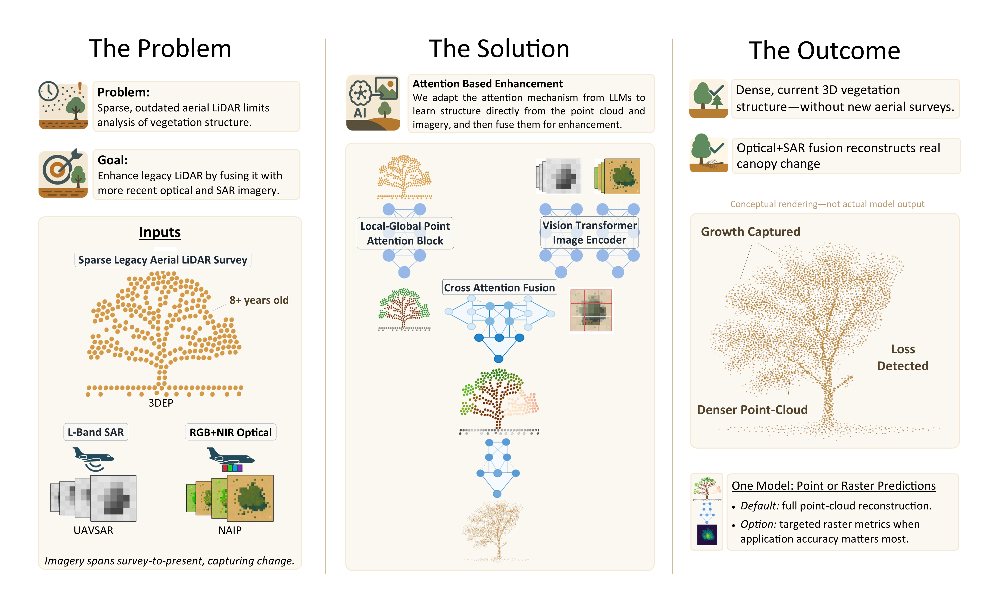

# Attention-Based Enhancement of Airborne LiDAR Across Vegetated Landscapes Using SAR and Optical Imagery Fusion



[](https://www.mdpi.com/2072-4292/17/19/3278)
[](https://doi.org/10.3390/rs17193278)

## Overview

This repository contains the complete codebase and manuscript for our research on enhancing sparse airborne LiDAR point clouds using deep learning and multi-modal sensor fusion. We introduce a novel framework built on **attention mechanisms—the same fundamental building blocks that power modern large language models**—to upsample sparse USGS 3DEP LiDAR (<22 pt/m^2) by fusing it with multi-temporal optical (NAIP) and L-band SAR (UAVSAR) imagery. The model uses attention to **learn structure directly from the point cloud itself** through a **Local-Global Point Attention Block (LG-PAB)** architecture that captures both fine-scale and long-range spatial patterns. By fusing LiDAR with multi-temporal imagery, our approach helps compensate for vegetation changes that occurred between surveys, extending the utility of historical LiDAR archives for ecological monitoring and land management.

**Key Findings:**
- **Combining multiple data sources** (LiDAR + optical + radar) produces more accurate 3D vegetation maps than using LiDAR alone
- **Fusing multiple data sources helps compensate for vegetation changes** that occurred between the old LiDAR survey (2015-2018) and newer imagery, making historical LiDAR archives more useful despite 5-9 year gaps
- **Works directly on 3D point clouds**, preserving fine-scale vegetation structure rather than converting to 2D images

**Novel Contributions:**
- First application of attention mechanisms (transformer-inspired architecture) for direct LiDAR point cloud enhancement
- Multi-modal fusion of LiDAR, optical, and SAR data for vegetation structure reconstruction
- Demonstrated effectiveness across fire-prone Southern California ecosystems

## Repository Structure

```python
geoai_veg_map/
├── src/
│   ├── data_prep/          # Data acquisition and preprocessing
│   │   ├── make_local_naip_stac.py          # Download NAIP optical imagery
│   │   ├── make_local_uavsar_stac.py        # Download UAVSAR L-band SAR
│   │   ├── make_local_3dep_stac.py          # Download 3DEP LiDAR (sparse input)
│   │   ├── make_local_uavlidar_stac.py      # Catalog UAV LiDAR (ground truth)
│   │   ├── generate_training_data.py        # Generate 10m x 10m training tiles
│   │   ├── train_test_split_and_precompute.py  # Split & precompute features
│   │   └── data_augmentation.py             # Geometric & point perturbations
│   ├── models/             # Model architectures
│   │   ├── multimodal_model.py              # Main model with LG-PAB blocks
│   │   ├── encoders.py                      # Vision Transformer encoders
│   │   ├── cross_attn_fusion.py             # Cross-attention fusion module
│   │   └── fusion.py                        # Alternative fusion strategies
│   ├── training/           # Training scripts
│   │   └── multimodal_training.py           # Main training loop & ablation studies
│   ├── evaluation/         # Evaluation and analysis
│   │   ├── inference_eval.py                # Run inference on test set
│   │   ├── manuscript_figures.py            # Generate publication figures
│   │   ├── RQ_test_v2.py                    # Statistical tests for research questions
│   │   └── generate_eval_df.py              # Generate evaluation dataframes
│   └── utils/              # Utility functions
│       ├── chamfer_distance.py              # Point cloud reconstruction metric
│       ├── knn_graph_gpu.py                 # GPU-accelerated KNN graphs
│       └── point_cloud_utils.py             # Point cloud processing utilities
├── scripts/                # End-to-end workflow scripts
│   ├── get_data.sh                          # Download all datasets
│   └── process_data.sh                      # Preprocess & prepare training data
├── manuscript/             # LaTeX manuscript and figures
│   ├── remote_sensing_submission.tex        # Published manuscript source
│   └── figures/                             # All manuscript figures
├── run_model_test.py       # Train a single model configuration
├── run_ablation_study.py   # Run ablation experiments (baseline, NAIP, UAVSAR, fused)
└── environment.yml         # Conda environment specification
```

## Published Paper

This repository supports the following publication:

**Marks, M.; Sousa, D.; Franklin, J.** "Attention-Based Enhancement of Airborne LiDAR Across Vegetated Landscapes Using SAR and Optical Imagery Fusion." *Remote Sensing* **2025**, *17*, 3278. https://doi.org/10.3390/rs17193278

The complete manuscript is available in [`manuscript/remote_sensing_submission.tex`](manuscript/remote_sensing_submission.tex).

## Getting Started

### Prerequisites

- CUDA-capable GPU with CUDA 12.4 toolkit
- Conda or Mamba package manager

### Installation

1. Clone this repository:
```bash
git clone https://github.com/yourusername/geoai_veg_map.git
cd geoai_veg_map
```

2. Create the conda environment:
```bash
conda env create -f environment.yml
conda activate geoai_env
```

### Data Requirements

The workflow requires four primary data sources:

1. **UAV LiDAR** (ground truth): High-density point clouds (>300 pt/m^2)
2. **3DEP LiDAR** (sparse input): USGS airborne LiDAR from Microsoft Planetary Computer
3. **NAIP Imagery** (optical): 4-band aerial imagery from Microsoft Planetary Computer
4. **UAVSAR** (L-band SAR): Fully polarimetric SAR from Alaska Satellite Facility (requires EarthData login)

**Study Areas** (as published):
- Sedgwick Reserve & Midland School, Santa Barbara County, CA
- Volcan Mountain Wilderness Preserve, San Diego County, CA

### UAV LiDAR Data Availability

The high-density UAV LiDAR datasets collected for this study (Sedgwick-Midland: 71 ha, Volcan Mountain: 197 ha) are being prepared for publication on OpenTopography.org. Due to file size constraints (>10 GB limit for community contributions), we are working directly with OpenTopography to make these datasets publicly accessible. In the interim, the UAV LiDAR ground truth data may be obtained by contacting the corresponding author at mmarks0561@sdsu.edu or mmarks13@gmail.com.

### Data Directory Structure

See [data/README.md](data/README.md) for the complete data directory structure, including:
- Expected directory layout and organization
- Data provenance (which files are downloaded vs. generated vs. user-provided)
- File format specifications and typical size ranges
- Step-by-step instructions for reproducing each data product

The repository includes the directory structure (`.gitkeep` files) but not the actual data files. Run the workflow scripts to populate the directories with data.

## Reproducing Manuscript Results

Follow these steps to reproduce the published results:

### Step 1: Data Acquisition

Edit [`scripts/get_data.sh`](scripts/get_data.sh) to set:
- Your EarthData credentials (for UAVSAR download)
- Study area bounding boxes
- Date ranges
- UAV LiDAR data paths

Then run:
```bash
bash scripts/get_data.sh
```

This will:
- Download UAVSAR imagery from Alaska Satellite Facility
- Download NAIP imagery from Planetary Computer
- Download 3DEP LiDAR from Planetary Computer
- Create STAC catalogs for all datasets

**Expected Output:** STAC catalogs in `data/stac/` with organized imagery and point cloud metadata. See [data/README.md](data/README.md) for complete directory structure and file descriptions.

### Step 2: Data Preprocessing

Edit [`scripts/process_data.sh`](scripts/process_data.sh) to configure:
- Tile filtering parameters (minimum points, coverage thresholds)
- Train/validation/test split ratios
- Voxel downsampling settings

Then run:
```bash
bash scripts/process_data.sh
```

This will:
- Generate 10m x 10m training tiles from STAC catalogs
- Split into training/validation/test sets based on spatial regions
- Precompute KNN graphs and normalize point clouds
- Create augmented training data (geometric transforms + point perturbations)

**Expected Output:**
- `data/processed/model_data/precomputed_training_tiles_32bit.pt`
- `data/processed/model_data/precomputed_validation_tiles_32bit.pt`
- `data/processed/model_data/precomputed_test_tiles_32bit.pt`
- `data/processed/model_data/augmented_tiles_32bit_16k_no_repl.pt`

See [`src/training/model_data_readme.md`](src/training/model_data_readme.md) for detailed data structure documentation.

### Step 3: Model Training

#### Option A: Train a Single Model

To train the full multi-modal model (LiDAR + NAIP + UAVSAR):

```bash
python run_model_test.py
```

Configuration options in the script:
- `feature_dim`: Feature dimension (default: 256)
- `up_ratio`: Upsampling ratio (default: 2)
- `k`: KNN neighbors (default: 16)
- `use_naip`, `use_uavsar`: Enable/disable modalities

#### Option B: Run Ablation Study

To reproduce all model variants from the paper:

```bash
python run_ablation_study.py
```

This trains four models:
1. **Baseline**: 3DEP LiDAR only
2. **NAIP**: LiDAR + optical imagery
3. **UAVSAR**: LiDAR + L-band SAR
4. **Fused**: LiDAR + optical + SAR (full model)

**Expected Output:**
- Trained model checkpoints in `models/checkpoints/`
- Training logs with loss curves

### Step 4: Evaluation

#### Generate Predictions

Run inference on the test set:
```bash
python src/evaluation/inference_eval.py \
    --model_path models/checkpoints/best_model.pt \
    --test_data data/processed/model_data/precomputed_test_tiles_32bit.pt \
    --output_dir results/predictions/
```

#### Statistical Analysis

Reproduce research question tests (Wilcoxon signed-rank tests, effect sizes):
```bash
python src/evaluation/RQ_test_v2.py \
    --eval_data results/evaluation_dataframe.pt
```

#### Generate Manuscript Figures

Create all figures from the paper:
```bash
python src/evaluation/manuscript_figures.py \
    --eval_data results/evaluation_dataframe.pt \
    --output_dir manuscript/figures/
```

**Expected Output:**
- Point cloud visualizations
- Error distribution plots
- Statistical comparison figures

### Computational Requirements

Training was performed using the following setup (from manuscript Table "Training protocol and hardware"):

- **Hardware**: 4 x NVIDIA L40 (48 GB) GPUs
- **Framework**: PyTorch DDP 2.5.1 (CUDA 12.4)
- **Optimizer**: ScheduleFreeAdamW (base lr: 5e-4, no external scheduler)
- **Loss**: Density-aware Chamfer distance (α=4 for meter-scale data)
- **Batch size**: 15 tiles per GPU (60 total)
- **Epochs**: 100
- **Training time**: ~7 hours per model variant

## Model Architecture

The model is built around the **Local-Global Point Attention Block (LG-PAB)**, a computational unit that sequentially applies local k-NN attention, optional feature-guided upsampling, and global position-aware attention. The architecture includes:

- **LG-PAB Point Feature Extraction**: Captures fine-scale geometry and long-range spatial context from the sparse point cloud
- **Vision Transformer Encoders**: Separate ViT encoders with temporal GRU aggregation for NAIP (optical) and UAVSAR (SAR) imagery
- **Cross-Attention Fusion**: Multi-head cross-attention to fuse point features with image patch embeddings
- **LG-PAB Expansion & Refinement**: Feature-guided upsampling (2×) followed by refinement to propagate context across the expanded point cloud
- **MLP Coordinate Decoder**: Final per-point residual offsets for precise 3D position predictions

The model operates directly on 3D point clouds (not rasters) and outputs enhanced point clouds with increased density and geometric accuracy.

## Citation

If you use this code or methodology in your research, please cite:

```bibtex
@article{marks2025attention,
  title={Attention-Based Enhancement of Airborne LiDAR Across Vegetated Landscapes Using SAR and Optical Imagery Fusion},
  author={Marks, Michael and Sousa, Daniel and Franklin, Janet},
  journal={Remote Sensing},
  volume={17},
  number={19},
  pages={3278},
  year={2025},
  publisher={MDPI},
  doi={10.3390/rs17193278},
  url={https://www.mdpi.com/2072-4292/17/19/3278}
}
```

## Authors

- **Michael Marks** - Department of Geography, San Diego State University (mmarks0561@sdsu.edu / mmarks13@gmail.com) [](https://orcid.org/0009-0005-3782-9431)
- **Daniel Sousa** - Department of Geography, San Diego State University [](https://orcid.org/0000-0002-1632-1955)
- **Janet Franklin** - Department of Geography & Center for Open Geographical Sciences, San Diego State University [](https://orcid.org/0000-0003-0314-4598)

## License

This project is made available for academic and research purposes. Please see the published paper for full details on data sources and usage restrictions.

## Acknowledgments

This research utilized:
- USGS 3D Elevation Program (3DEP) LiDAR data
- USDA National Agriculture Imagery Program (NAIP) imagery via Microsoft Planetary Computer
- NASA/JPL UAVSAR data from Alaska Satellite Facility
- Compute resources from the Technology Infrastructure for Data Exploration (TIDE) at San Diego State University, supported by NSF OAC Award #2346701

For questions or collaboration inquiries, please contact Michael Marks at mmarks0561@sdsu.edu or mmarks13@gmail.com.
