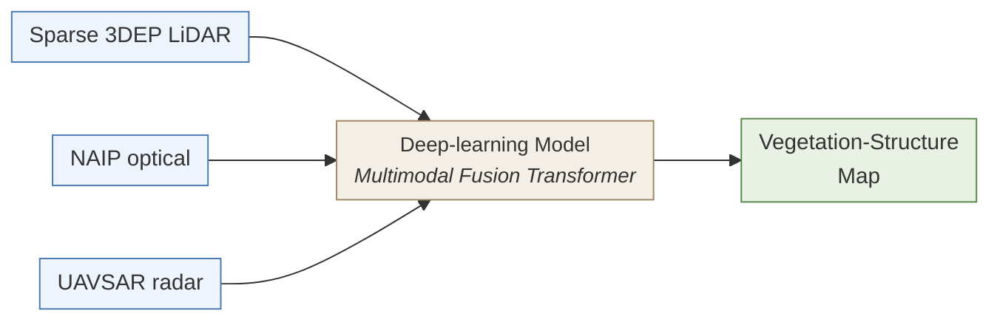

# GeoAI Raster Vegetation Structure

**A multimodal deep-learning model that maps vegetation structure across Southern California by fusing sparse public LiDAR with optical and radar imagery, and that measurably outperforms raw LiDAR alone at the structural layers hardest to see from above.**

Extends [Marks, Sousa & Franklin, *Remote Sensing* (2025)](https://doi.org/10.3390/rs17193278) ([published code: `geoai_veg_map`](https://github.com/mmarks13/geoai_veg_map)) from dense point-cloud reconstruction to ecologically meaningful vegetation-structure rasters, validated against field plots at four out-of-distribution sites.



## Results
Across 49 field plots at four Southern California sites the model never saw during training, fusing sparse public LiDAR with multi-temporal aerial imagery yields substantially more accurate estimates of the vegetation structure than calculating from raw public LiDAR alone:

- For **1–3 m vegetation layer (forest understory or chaparral)**, the model explains roughly **3× more** of the plot-to-plot variation than raw public LiDAR alone (*r*² 6% → 19%; Williams *t*, *p* = 0.025).
- Ranking those 49 plots by predicted 1–3 m density matches a field biologist's ordering nearly **twice as well** as ranking them by raw LiDAR (Spearman *ρ* 0.18 → 0.34).
- For **canopy cover**, fusion captures more than 3× more of the plot-to-plot variation at the held-out site with the oldest public LiDAR (2015 vs 2018–19 elsewhere; r² 10% → 34%) and adds little where the LiDAR is more recent (overall Pearson r 0.47 → 0.48), suggesting the value of fusion is to keep structural estimates current as public LiDAR ages.


<details>
<summary><b>Methodology and overall statistics</b></summary>

Trained on dense UAV-LiDAR ground truth at Sedgwick Reserve and Volcan Mountain, and evaluated against 49 matched field plots at four ecologically distinct held-out sites (Bluff Mesa, North Big Bear, Reyes Peak, Laguna) spanning mixed chaparral, Jeffrey pine, and mixed-conifer forest. Two variables have independent field measurements: canopy cover and 1–3 m vegetation density. Field measurements and LiDAR-derived structure are related but non-equivalent indicators, so these numbers reflect stronger agreement with independent field observations, not exact one-to-one prediction.

| Metric                   | n  | Pearson *r* (B → M) | Spearman *ρ* (B → M) | RMSE (B → M)      | Williams *t* (*p*) |
| ------------------------ | -- | ------------------- | -------------------- | ----------------- | ------------------ |
| Canopy cover             | 49 | 0.466 → 0.475 ↑     | 0.512 → 0.556 ↑      | 16.670 → 16.507 ↓ | 0.126 (0.901)      |
| 1–3 m vegetation density | 49 | 0.236 → 0.439 ↑     | 0.177 → 0.338 ↑      | 17.505 → 15.593 ↓ | **2.325 (0.025)**  |

B → M = Raw 3DEP LiDAR baseline → Multimodal model. ↑/↓ indicates the direction preferred for that metric (↑ for *r*, *ρ*; ↓ for RMSE). Williams *t* = dependent-correlation test on the difference in Pearson *r*.

</details>

<details>
<summary><b>Per-site breakdown (4 held-out sites, 49 plots)</b></summary>

**1–3 m vegetation density**

| Site          | n  | Pearson *r* (B → M) | Spearman *ρ* (B → M) | RMSE (B → M)    |
| ------------- | -- | ------------------- | -------------------- | --------------- |
| BluffMesa     | 7  | 0.50 → **0.65**     | 0.57 → **0.79**      | 14.7 → **10.2** |
| NorthBigBear  | 11 | 0.60 → **0.79**     | 0.43 → **0.71**      | 22.4 → **18.5** |
| ReyesPeak     | 18 | –0.19 → 0.04        | 0.00 → 0.16          | 10.7 → 12.4     |
| Laguna        | 13 | –0.31 → –0.21       | –0.35 → –0.17        | 21.3 → **18.9** |

**Canopy cover**

| Site          | n  | Pearson *r* (B → M) | Spearman *ρ* (B → M) | RMSE (B → M)    |
| ------------- | -- | ------------------- | -------------------- | --------------- |
| BluffMesa     | 7  | 0.59 → 0.49         | 0.61 → 0.39          | 18.7 → 18.8     |
| NorthBigBear  | 11 | 0.64 → **0.71**     | 0.57 → **0.58**      | 15.7 → **14.8** |
| ReyesPeak     | 18 | 0.57 → 0.52         | 0.64 → 0.58          | 14.5 → 15.1     |
| Laguna        | 13 | 0.32 → **0.58**     | 0.29 → **0.58**      | 19.0 → **18.3** |

B → M = Raw 3DEP LiDAR baseline → Multimodal model. Bold = model improves on baseline. At the overall level (all 49 plots pooled), the 1–3 m density gain is statistically significant (Williams *t*, *p* = 0.025); canopy-cover gains are not significant overall but are large and consistent at the site with the oldest LiDAR acquisition.

</details>

## Lineage: From Point Clouds to Structure

The [2025 *Remote Sensing* paper](https://doi.org/10.3390/rs17193278) proved that multimodal fusion of sparse LiDAR, NAIP, and UAVSAR can enhance LiDAR point clouds in vegetated landcapes. Points, however, are a means rather than an end. Ecologists, fire modelers, and land managers work in terms of structure: cover, height, density by layer, not raw returns.

This repo closes that gap. It reuses the published encoder lineage (see [`geoai_veg_map`](https://github.com/mmarks13/geoai_veg_map)) and swaps the decoder to predict a gridded raster of vegetation-structure variables directly, then validates the result against field plots at four sites the model never saw during training.


<details>
<summary><b>Architecture details</b></summary>

See [`src/models/README.md`](src/models/README.md) for file-level specifics. At a glance:

- **LG-PAB point feature extractor** combines local k-NN point attention with global position-aware attention ([`src/models/multimodal_model.py`](src/models/multimodal_model.py)).
- **Image encoders** are separate ViTs for NAIP and UAVSAR with temporal GRU aggregation ([`src/models/encoders.py`](src/models/encoders.py)).
- **Cross-attention fusion** uses multi-head cross-attention from point features into image patch embeddings ([`src/models/cross_attn_fusion.py`](src/models/cross_attn_fusion.py)).
- **Raster decoder** consists of learnable per-cell grid queries, Gaussian distance-biased cross-attention into fused point features, pre-LN FFN, and a 1×1-conv MLP head with an optional heteroscedastic (mean + log-variance) output ([`src/models/raster_head.py`](src/models/raster_head.py), [`src/models/multimodal_raster_model.py`](src/models/multimodal_raster_model.py)).

</details>

<details>
<summary><b>Regularization and inference-time uncertainty</b></summary>

On top of standard dropout, weight decay, and gradient clipping, the raster model adds:

- **Spectral normalization** on decoder linear and conv layers, a Lipschitz constraint that bounds the model's sensitivity to input perturbations.
- **Stochastic depth (DropPath)** randomly drops entire residual branches in the point-attention extractor, regularizing beyond activation-level dropout.
- **Heteroscedastic Gaussian NLL loss** with an overconfidence penalty. The decoder predicts both a mean and a per-pixel variance; uncertain regions are naturally down-weighted in the gradient, and the penalty discourages collapse to over-confident variance estimates.
- **Huber loss (δ = 2.0)** is retained behind a config flag as a robust-regression alternative.
- **Auxiliary Foliage Height Diversity (FHD) target** is predicted alongside the evaluated bands. The extra task regularizes the shared encoder toward richer vertical-structure features even though FHD is not itself compared against field measurements.
- **Monte-Carlo Dropout at inference.** Dropout layers remain active; multiple stochastic forward passes yield a predictive mean and a pixel-wise uncertainty estimate.
- **Stochastic Weight Averaging (SWA)** is implemented (via `torch.optim.swa_utils`) and was tested, but MC Dropout alone was retained as the final inference-time method.

MC Dropout was also informative during model development: the predictive-uncertainty signal consistently flagged UAVSAR as a source of instability at out-of-distribution sites, which, together with held-out Pearson comparisons, motivated dropping UAVSAR from the final training run.

</details>

<details>
<summary><b>Online GPU augmentation</b></summary>

All augmentation is applied online on the GPU (Kornia plus custom PyTorch ops) rather than precomputed offline, so each tile is freshly perturbed every epoch and sampling probabilities can be tuned without regenerating data.

- **Modality dropout.** NAIP and/or UAVSAR dropped per-tile at 25% / 35% during training, forcing each modality pathway to produce useful features on its own and bounding the cost of a missing modality at inference time.
- **Temporal augmentation.** Random subsampling of NAIP/UAVSAR temporal stacks plus large temporal shifts (±730 days) of acquisition dates, decoupling the model from any single phenological snapshot.
- **Synchronized geometric augmentation.** Rotations and X/Y reflections applied identically to points, imagery, and target rasters.
- **Point-cloud sparsification.** Random point removal up to 90%, enabled by a global-only attention mode that recomputes neighborhoods on the fly rather than relying on precomputed KNN graphs.
- **Point-level perturbations.** Coordinate jitter, intensity noise, return-attribute scaling and shuffling, and rare bird / outlier simulation.
- **Imagery perturbations.** Gaussian and motion blur, random erasing, sharpness, additive noise, and z-score radiometric gain and bias for both NAIP and UAVSAR.

</details>

<details>
<summary><b>LiDAR direct-measurement baseline: design and site characterization</b></summary>

To isolate the value-add of multimodal fusion, the same Moudry vegetation-structure metric pipeline used for UAV ground truth is applied directly to the raw sparse 3DEP point clouds at each validation site. This produces a LiDAR-only structural reference that can be compared against both field measurements and the multimodal model's predictions. Entry point: [`src/evaluation/compute_3dep_baseline_metrics.py`](src/evaluation/compute_3dep_baseline_metrics.py).

**3DEP data characterization at validation sites**

| Site          | Acquisition | Unique points | Density (pts/m²) | Pre-classified ground |
| ------------- | ----------- | ------------- | ---------------- | --------------------- |
| BluffMesa     | 2018        | 4.05 M        | 7.3              | Yes (25.3%)           |
| NorthBigBear  | 2018        | 16.9 M        | 7.4              | Yes (31.2%)           |
| ReyesPeak     | 2018        | 56.9 M        | 7.8              | Yes (23.7%)           |
| Laguna        | 2015        | 30.7 M        | 11.5             | Yes (44.1%)           |

</details>

## Changes from the Published Pipeline

The raster predictor reuses the encoder backbone of the [published point-cloud upsampling model](https://github.com/mmarks13/geoai_veg_map) and swaps the output target from a dense 3D point cloud to a small gridded raster of vegetation-structure metrics. Along the way, a set of encoder-level improvements were folded in that benefit both pipelines. At a glance, the encoder now keeps positional and semantic information cleanly separated, attention and neighborhood graphs are restricted to within-tile context, and the NAIP tokenizer preserves within-patch texture instead of averaging it away.

|                     | Original model                                                  | New model                                                                                        |
| ------------------- | --------------------------------------------------------------- | ------------------------------------------------------------------------------------------------ |
| **Output**          | Dense **3D point cloud**                                        | Small **raster** of vegetation-structure metrics                                                 |
| **Prediction head** | Upsamples points, then regresses an xyz coordinate for each one | A fixed grid of learned attention queries, each pooling nearby point features into a raster cell |

<details>
<summary><b>Encoder fixes and additional improvements (details)</b></summary>

**Issues fixed in the published encoder**

- **Cleaner attention math.** The original global point-attention block conflated *where to attend* with *what to aggregate*, letting positional information leak into the aggregated features. The block was rewritten so the two roles are kept separate.
- **No cross-tile contamination.** In the original implementation, when multiple tiles shared a minibatch, points in one tile could attend to points in another through the global attention and nearest-neighbor graphs. Both are now restricted to within-tile context.
- **Higher-fidelity optical tokenizer.** The original NAIP tokenizer averaged each patch into a single value per channel, discarding the within-patch texture that distinguishes vegetation structure at NAIP's resolution. Patches are now formed by a learned projection that preserves it.

**Additional improvements**

- **Terrain-relative heights.** Point heights are now expressed relative to the local ground surface rather than the lowest point of the tile, giving the model a stable prior on the ground.
- **Standardized point coordinates.** The published model trained on raw meter-scale coordinates, where the height axis was typically much larger than the planar axes. Modern deep-learning layers are optimized for standardized inputs, so coordinates are now z-scored per axis using statistics computed once over the training set.

</details>

## Getting Started

Environment setup is via Conda:

```bash
conda env create -f environment.yml
conda activate geoai_env
```

Data preparation, training, and evaluation pipelines are documented in [`scripts/README.md`](scripts/README.md) and [`src/README.md`](src/README.md). Primary entry points:

- Training: `run_raster_model.py`
- Forest-plot evaluation: `scripts/evaluate_forest_plots.sh`
- LiDAR direct-measurement baseline: `src/evaluation/compute_3dep_baseline_metrics.py`

## Future Direction

**Broader sensor palette.** UAVSAR coverage is sparse, inconsistent, and (in this project) noisy enough that it was dropped from the final training run. In the near term, Sentinel-1 (10 m, open, global, high temporal cadence) is the natural SAR replacement. Longer term, NISAR opens up L-band coverage at a scale that UAVSAR cannot match.

**Foundation-model encoders for generalization.** The more I work on this, the more the evidence points to generalization, not architecture, as the dominant limiter. Imagery foundation models are the natural next step for the image-encoder pathway. An early attempt at using [Clay](https://clay-foundation.github.io/model/release-notes/specification.html) was set aside because its 256 × 256-pixel training scale was too coarse for the 10–40 m tile footprints here. [AnySat](https://github.com/gastruc/AnySat) trains at scales as small as 60 × 60 m, which fits this pipeline's constraints and is a promising candidate for the next iteration.

**A point-cloud foundation model on 3DEP.** To my knowledge no such model exists at continental scale on airborne LiDAR. Given that 3DEP is open, standardized, and near-continental in US coverage, this is plausibly the highest-leverage piece of missing infrastructure for this problem family, and a research direction I would pursue given the opportunity.

## Related Publication

Marks, M.; Sousa, D.; Franklin, J. **Attention-Based Enhancement of Airborne LiDAR Across Vegetated Landscapes Using SAR and Optical Imagery Fusion.** *Remote Sensing* **2025**, *17*, 3278. <https://doi.org/10.3390/rs17193278>. Published code: [`geoai_veg_map`](https://github.com/mmarks13/geoai_veg_map).

```bibtex
@article{marks2025attention,
  author  = {Marks, Michael and Sousa, Daniel and Franklin, Janet},
  title   = {Attention-Based Enhancement of Airborne LiDAR Across Vegetated Landscapes Using SAR and Optical Imagery Fusion},
  journal = {Remote Sensing},
  volume  = {17},
  number  = {19},
  pages   = {3278},
  year    = {2025},
  doi     = {10.3390/rs17193278}
}
```

## Contact

**Michael Marks**. <mmarks13@gmail.com>. Department of Geography, San Diego State University.
